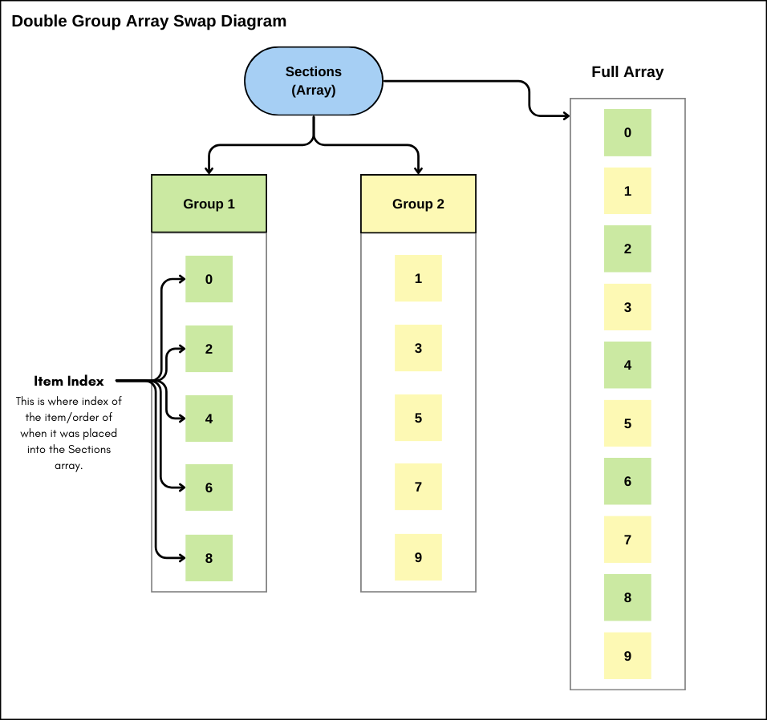

# Single Array, Double Group Swap Problem & Solution

## Introduction
<!-- Add the link to the page where I am showing off the ADDO app -->
This document here, along with the code is a problem that I was faced with when working on the app my brother and I are developing (he designed it, I developed it). I won't get into too many details about the app here, but if you would like to learn more about it [Click Here!](https://hyrumparamore.github.io/ADDO-Demo.github.io/index.html)

Anyway, this is a problem that I was faced with how I had developed the app and the way that the data was being stored. It was an array problem that I'm sure there was a solution to somewhere, but I decided that I wanted to figure it out myself with the knowledge I had. I created a program in XCode, and it's written in Swift/SwiftUI. I wanted to make it as close as I could to the problem inside the app itself, so I made it interactive and made sure it worked correctly. So here it is!

There will be a demo video coming soon!
<!-- If you want to see how the program works, I created a short video going over it below: -->

<!-- Add the video link (also create the video to actually add) -->

<!-- * ### [Watch the Demo Video Here!](linkGoesHere) <br> </br>-->


---

## The Problem I Faced/Context
As I mentioned above, the problem that I faced came from trying to implement a feature into the app that I have been developing. This feature tries to move different sections up and down a view so that they can be placed wherever the user desires. One big issue was that I had already developed most of the app, and so at this point, it would've been very hard and taken a lot of time to redo how some of the data is managed, specifically the sections inside the app, so I decided that I wanted to create a solution to that rather than having to change and make many different changes to the code.

In the app itself, I mainly use arrays to keep track of and manage the data. These arrays contain objects inside of them, which contain more arrays. For example, an array that contains the `sections`, and then a single `section` contains `tasks` assigned to those sections, and then those `tasks` contain elements for creating and displaying `tasks` that the user manages. These `sections` basically store all the data for the tasks. But the main issue is that in the program, I have two **Views** that display specific `sections`, one being a *"Planner"* view, and one being a *"Someday"* view. Both views display `sections` that have *identifiers* inside of them to help distinguish which go where and are added when the `sections` are created. This allows for only the `sections` and `tasks` to be displayed if the `section` and the `section` identifiers match.
<br> </br>

---

## The Problem Itself
With all that context out of the way, I can now get on with what the problem itself was.

<!-- Diagram Image Here -->
Refer to the image below to help visualize how the array is built and the groups are established:
<p align="center">
  
</p>

##### *(Each item inside of the array (a section) has an index. That index is the order in which the sections were added to the array. The "Full Array" displays what the array would look like if it was displayed.)*

Since I only have one main array that contains all of the different sections, it makes it difficult to manage or move around the elements of the array inside two different views that display different selected sections. Let's now see how it was done!
<br> </br>

### **Let's go through some code to explain some stuff :D**

A Section will be created and contains an id, title, and a group that helps distinguish it. This allows for the creation of many sections that could contain different elements within. But in this example, we will just focus on the "groups" element within.
```swift
// Allows for the creation of Sections to be used when needed.
struct Section: Identifiable {
   var id = UUID() // Gives it a unique ID to help manage.
   var title: String // Title to print out what it is.
   var group: String // Classification to help place it in groups to sort/filter.
}
```

Next is the class that will be managing the data and the movement of it. This class contains one protocol and one variable. The protocol, which is the ObservableObject protocol, is an essential part of SwiftUI MVVM (Model-View-ViewModel) architecture and enables data flow from the ViewModel to the view, allowing automatic UI updates when the observed data changes. Updating the view/display in real-time when the data is assigned to, this being the sections variable, which is an array of sections.
```swift
class ViewModel: ObservableObject {
   // Creates an array to store the sections inside of the ViewModel and allows it to be used elsewhere.
   @Published var sections : [Section] = []

   // Initializes/creates the sections and adds them to an array.
   init() {
       // This function creates and appends sections into the sections array (Creates 10 sections).
       createDummySections()
   }

   // ...Other functions that allow for the movement of sections within the section groups...
}
```

With those two elements created, the ViewModel now contains an array of sections. But now I need to be able to move those items up and down the array without affecting the separate groups. Meaning, if I wanted to move the top section/index in Group 1 down, I would simply just need to move or swap it down an index right? That is what I thought at first until I realized that inside the array of sections, we may not know the order of the section groups. This means to move the first section inside of Group 1 down one, it would need to first filter out the sections by groups, so I would need to take the first group section index, save it into a variable, and then take that index and loop through the main sections array to find the next section down that is also in Group 1 and then swap those two indexes. And that pretty much does it! When looking at the code, it seems pretty simple, but I spent a lot of time thinking about how to make it work and not give me any errors. One idea was to create a new array that contains the filtered sections based on their groups, but that didn't work because it would not have updated the main sections inside the main array. I tried a bunch of different things, but this works perfectly and I have no issues with it!


This is the function to move a section down. The comments in the code below help to understand how the function works:
```swift
// Function that moves a section DOWN based on the index and the Group.
func moveSectionDown(sectionIndex: Int, groupNumber: Int) {

   // Find the section that is below the current sectionIndex.
   var secondSectionIndex = -1

   // Loop through the sections starting from the index after the current sectionIndex.
   for index in (sectionIndex + 1)..<sections.count {
       // Check if the current section's group matches the specified groupNumber.
       // If groupNumber is 1, compare the section's group to "Group 1"; otherwise, compare it to "Group 2".
       if sections[index].group == (groupNumber == 1 ? "Group 1" : "Group 2") {
           // Store the index of the next section belonging to the specified group.
           secondSectionIndex = index
           // Exit the loop as the desired section is found.
           break
       }
       // Continue iterating through sections until finding a match or reaching the end.
   }

   // Run a check.
   if secondSectionIndex != -1 {
       // Swap the sections at sectionIndex and secondSectionIndex.
       sections.swapAt(sectionIndex, secondSectionIndex)
       // Now the sections have been swapped.
       print("Sections have been swapped.")
   } else {
       // Prints error if it didn't swap, or if it is on the bottom of the array.
       print("Couldn't find the section to swap with.")
   }
}
```

The function to move a section up is very similar, but this is the only change that it has, and it is the condition for the loop and what it is looping over. Mainly being that it goes backward down the array from the sectionIndex indicated:
```swift
// Iterate through the sections in reverse order, starting from the section just before the current sectionIndex.
for index in (0..<sectionIndex).reversed() {
   // Check if the current section's group matches the specified groupNumber.
   // If groupNumber is 1, compare the section's group to "Group 1"; otherwise, compare it to "Group 2".
   if sections[index].group == (groupNumber == 1 ? "Group 1" : "Group 2") {
       // Store the index of the previous section belonging to the specified group.
       secondSectionIndex = index
       // Exit the loop as the desired section is found.
       break
   }
   // Continue iterating through sections until finding a match or reaching the beginning.
}
```

And that's about it! Not much to it other than it was a fun brain teaser! This was a fun problem that I had to solve and figure out, and then after making it, to then implement it into the app I'm developing. There were some different changes that I had to adjust to like the different types of data inside the app, but the overall concept is the same and it works perfectly with no issues!
<br> </br>
*Thank you for taking the time to read through this!*

---

## Resources
* XCode
* Swift/SwiftUI
* VSCode
* GitHub
